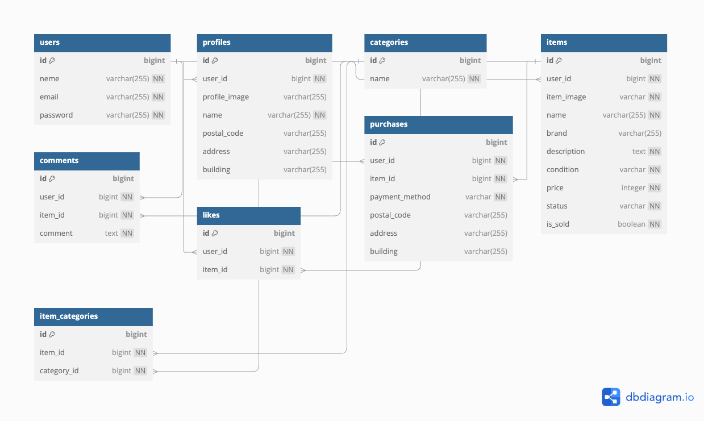

# coachtechフリマ

## プロジェクト概要
coachtechフリマは、ユーザーが商品を出品し、購入できるフリーマーケットアプリです。
会員登録機能、ログイン機能、商品検索、マイリスト、おすすめ商品の表示、コメント機能などを実装しています。

## 機能一覧
- ユーザー登録・ログイン機能(メール認証あり)
- 商品の出品
- 商品の検索・絞り込み
- おすすめ商品表示
- マイリスト機能
- コメント機能(ユーザーのプロフィール画像付き)
- 商品購入(購入確定後のステータス管理)

## 環境構築
### Dockerビルド
1. git clone git@github.com:nami49s/coachtech_fleamarket.git
2. cd coachtech_fleamarket
3. docker-compose up -d --build

* MySQLは、OSによって起動しない場合があるのでそれぞれのPCに合わせてdocker-compose.ymlファイルを編集してください。

### Laravel環境構築
1. docker-compose exec php bash
2. composer install
3. .env.exampleをコピーして.envを作成し、環境変数を変更
4. 作成した.envファイルをsrcに移動
5. php artisan key:generate
6. php artisan migrate
7. php artisan db:seed
8. php artisan serve
* うまくいかない場合はDB_HOST=mysqlにしてキャッシュクリア、その後mysqlでDROP DATABASE IF EXISTS laravel_db;とCREATE DATABASE laravel_db;を実行した後にマイグレーションとシーディングを行ってください。

## 使用技術
- PHP 8.4.3
- Laravel 8.83.29
- MySQL 9.1.0

## 使用ライブラリ
- Laravel Fortify(認証機能)

## メール送信設定 (Mailtrap)
- 本アプリはテスト用のメール送信に Mailtrap を使用しています。
- '.env' に以下の設定を追加してください。
```env
MAIL_MAILER=smtp
MAIL_HOST=sandbox.smtp.mailtrap.io
MAIL_PORT=2525
MAIL_USERNAME=your_mailtrap_username
MAIL_PASSWORD=your_mailtrap_password
MAIL_ENCRYPTION=tls
MAIL_FROM_ADDRESS=test@example.com
MAIL_FROM_NAME="coachtech_fleamarket"
```
- Mailtrap の設定後、以下のコマンドでメール送信をテストできます。
php artisan tinker
			Mail::raw('テストメール', function($message) {
                $message->to('test@example.com')->subject('Test Email');
            });

## 決済機能 (Stripe)
- 本アプリでは Stripe を使用して決済を実装しています。
- '.env' に以下の設定を追加してください。
```env
STRIPE_KEY=your_stripe_public_key
STRIPE_SECRET=your_stripe_secret_key
```

- ローカル環境で決済をテストする場合は、Stripe のテストカードを使用できます。
  - **カード番号:** `4242 4242 4242 4242`
  - **期限:** `12/34`
  - **CVC:** `123`
- 実際の支払いを行う場合は、Stripe の管理画面で **ライブモードに切り替えて** 正しい API キーを設定してください。

## URL
- 開発環境:http://localhost
- phpMyAdmin:http://localhost:8080

## ER図


## テストユーザー情報
一般ユーザー:
シーディングで作成されるテストユーザーのメールアドレスは、毎回異なります。これは、test と現在時刻 (time()) を組み合わせて一意のメールアドレスを生成しているためです。
- メール: `test{timestamp}@example.com`（例: `test1609459200@example.com`）
- パスワード: password
このテストユーザーは、UsersTableSeeder によって作成されます。